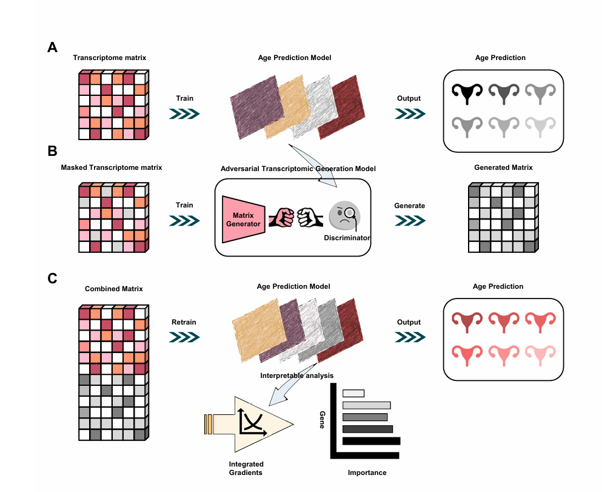
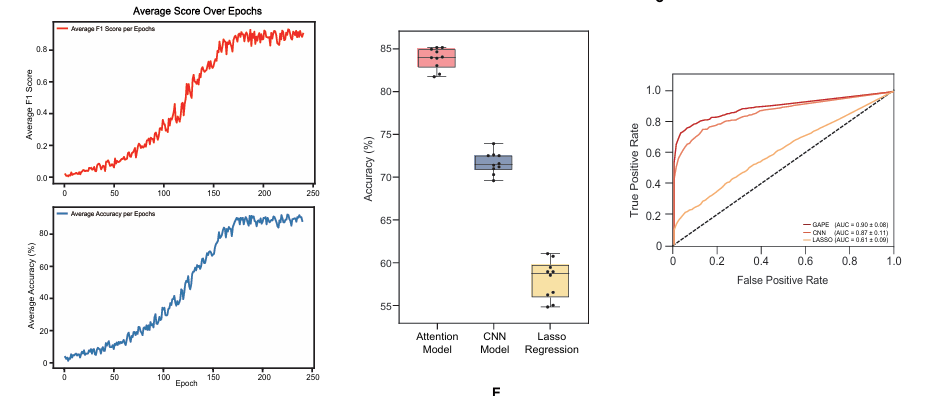
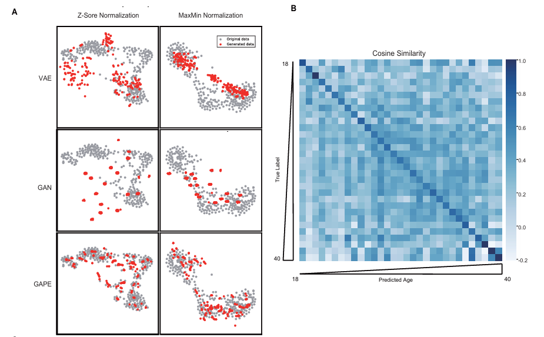
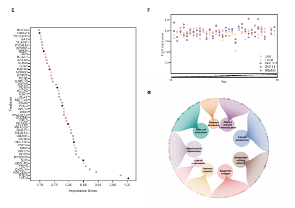
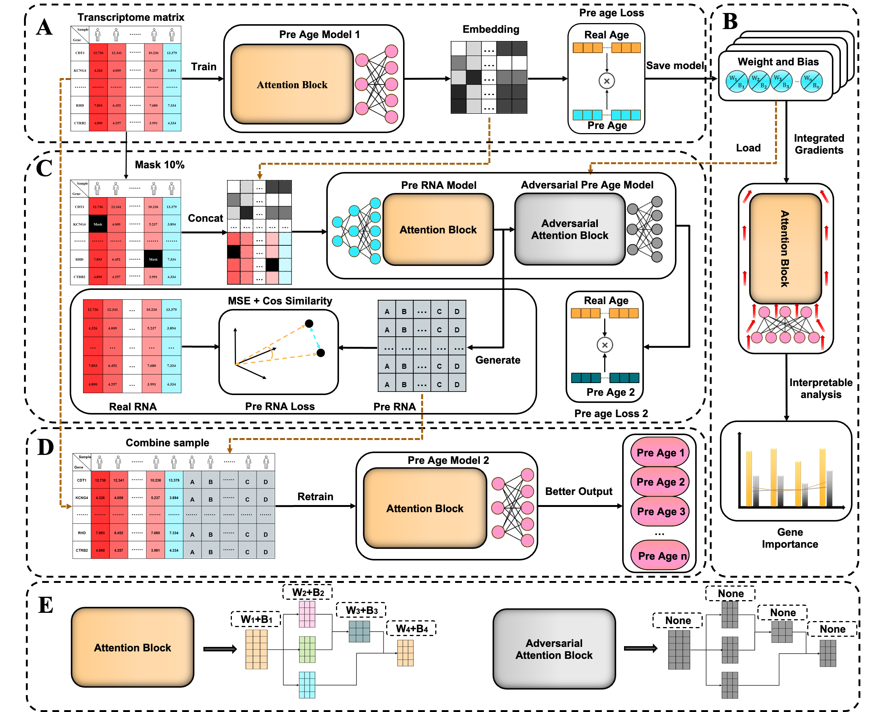

# GAPE
**In this study, we aim to develop a tool to predict endometrial age and generate corresponding transcriptomic data according to age, to help estimate endometrial aging and function and generate corrected data.**

## Environment

Please install the necessary libraries according to the following requirements.  
This program support running in the Linux or Windows system.
We suggest using the conda-environment to manage your program.

### Dependency library

Please refer to the requirements.txt file to install the following libraries:

- `pytorch==2.5.1`
- `python==3.11`
- `pandas==2.2.3`
- `seaborn`
- `tqdm`
- `pandas`
- `scikit-learn`
- `matplotlib`
- `numpy`
- `captum`

You can use' pip' to install the project's dependency library:

```bash
pip install -r requirements.txt
```
### Run
## APM  Age_pre_model

You can run the APM by typing the following from the command line:

```bash
python age_pre_train.py
```
Please make sure your data in the dir 'data' as name **'train_data.csv'**, you can rename it in the **line 20** of **age_pre_train.py**  

If you want to modify the Hyperparameter of this model, you can change the number of **num_epochs, save_epochs, input_embedding, batch_size and lr** in **run.py**  

**input_embedding:** The larger the input_embedding, the more original information will be retained, and the training time will also increase.

**save_epochs:** The model will save the optimal parameters after save_epochs.


## ATGM  adversarial transcriptomic generation model
You can run the ATGM by typing the following from the command line:

```bash
python rna_pre_train.py
```
Please run **'age_pre_test'** on train_dataset to generate the train_dataset_embedding before run rna_pre_train.py

### Result
The optimal model parameters will be saved in the **run/RNA_model_best.pt** folder.

You can generate transcriptomic data by using:

```bash
python rna_generate.py
```


## gene importance analysis using integrated_gradines

You can generate gene importance by using:

```bash
python integrated_gradines_analysis.py 
```
The resulte will be save as top_100_attribution_data.csv


### Program structure
```bash
.
├── age_pre_model.py                   # age pre model (APM)
├── age_pre_train.py                   # train APM model
├── age_pre_test.py                    # test the trained model
├── rna_pre_model.py                   # adversarial transcriptomic generation model (ATGM)
├── rna_pre_train.py                   # train ATGM
├── rna_generate.py                    # using trained ATGM to generate transcriptomic data
├── integrated_gradines_analysis.py    # using ig to analysis the gene's importance
├── requirements.txt                   # Libraries and versions required for the project
├── data/                              # The folder where the dataset is stored.
├── results/                           # model training results dir
├── run/                               # optimal model parameters dir
├── README.md                          # Description document of the project
```
### Our Method

